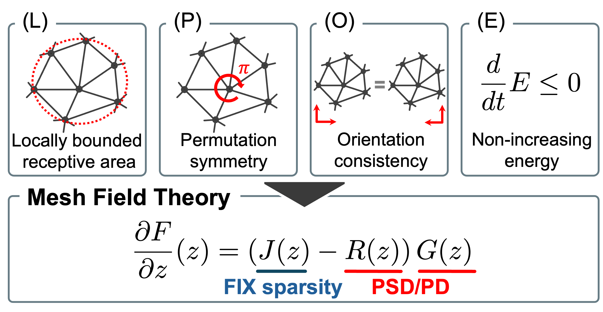

# MeshFT-Net

[](https://arxiv.org/abs/2605.00394)
[](https://icml.cc/)

This repository contains the **official minimal implementation** of **MeshFT-Net**, the neural realization of **Mesh Field Theory**, accepted at **ICML 2026**. See our paper on [arXiv](https://arxiv.org/abs/2605.00394).

---

## Introduction

Learning physical dynamics on meshes is difficult because mesh topology, geometry, material response, and dissipation are often mixed together inside a generic neural network. This can lead to unstable long-horizon rollouts, energy drift, and non-physical modes.

**Mesh Field Theory (MeshFT)** separates these roles:

* the **topological conservative structure** is fixed by signed incidence operators from the mesh,
* the **metric, material, and dissipative effects** are learned from data,
* the resulting model, **MeshFT-Net**, is designed to preserve physical structure while remaining trainable as a neural simulator.

In short: **fix topology, learn metric and dissipation**.

<p align="center">
  
</p>

---

## Contents

This repository comprises compact benchmark runners for the main experiments in the paper:

* **Analytic Wave Benchmark**: closed-form 2D plane waves on grid and Delaunay meshes; evaluates one-step error, rollout error, and energy drift.
* **OOD Benchmark**: frequency, resolution, parameter, and long-horizon extrapolation for analytic wave dynamics.
* **Physical Consistency Benchmark**: diagnostics such as wave-speed error, canonical consistency, PDE residual, equipartition, and momentum conservation.
* **Dissipative Benchmark**: controlled damped wave dynamics for testing learned dissipation and energy decay.
* **The Well / Acoustic Scattering Benchmark**: MeshFT-Net on the `acoustic_scattering_discontinuous` dataset from The Well.
* **Ablation Study**: topology, orientation, metric positivity, and learned-interconnection ablations.
* **Computational Cost Benchmark**: inference time, training time, parameter count, and memory usage.

---

## Installation

Create a clean environment and install the required packages:

```bash
conda create -n meshft-net python=3.10 -y
conda activate meshft-net
pip install -r requirements.txt
```

The scripts use CUDA by default when available. On a CPU-only machine, use:

```bash
DEVICE=cpu bash scripts/run_analytic_wave_bench.sh
```

---

## Quick Start

Run the analytic wave benchmark:

```bash
bash scripts/run_analytic_wave_bench.sh
```

Results are written under `runs/`.

---

## Running Experiments

Each experiment has a shell script with default settings. You can run them directly.

### Analytic wave benchmark

```bash
bash scripts/run_analytic_wave_bench.sh
```

### OOD extrapolation benchmark

```bash
bash scripts/run_ood_bench.sh
```

### Physical consistency benchmark

```bash
bash scripts/run_phys_bench.sh
```

### Dissipative benchmark

```bash
bash scripts/run_dissipative_bench.sh
```

### The Well / acoustic scattering benchmark

```bash
bash scripts/run_well_bench.sh
```

This script uses The Well dataset interface. Depending on your environment, the dataset may be downloaded or cached through Hugging Face / The Well.

### Ablation study

```bash
bash scripts/run_ablation.sh
```

### Computational cost benchmark

```bash
bash scripts/run_computational_cost_bench.sh
```

---

## Repository Structure

```text
.
├── analytic_wave_bench.py
├── dissipative_bench.py
├── extrapolation_bench.py
├── phys_consistency_bench.py
├── the_well_bench.py
├── meshft_ablation.py
├── cost_bench.py
├── requirements.txt
└── scripts/
    ├── run_analytic_wave_bench.sh
    ├── run_ood_bench.sh
    ├── run_phys_bench.sh
    ├── run_dissipative_bench.sh
    ├── run_well_bench.sh
    ├── run_ablation.sh
    └── run_computational_cost_bench.sh
```

---

## Citation

We will update this section with the formal ICML / PMLR citation once the proceedings metadata is publicly available.
In the meantime, if you find **MeshFT-Net** useful, please cite the arXiv preprint.

- Paper: [arXiv](https://arxiv.org/abs/2605.00394)
- Code: this repository

<!-- TODO: Replace the BibTeX below with the ICML/PMLR proceedings entry after the conference metadata is public. -->

### BibTeX (temporary, arXiv)

```bibtex
@misc{noguchi2026meshfieldtheory,
  title         = {Mesh Field Theory: Port-Hamiltonian Formulation of Mesh-Based Physics},
  author        = {Satoshi Noguchi and Yoshinobu Kawahara},
  year          = {2026},
  eprint        = {2605.00394},
  archivePrefix = {arXiv},
  primaryClass  = {cs.LG},
  doi           = {10.48550/arXiv.2605.00394},
  note          = {Accepted to ICML 2026}
}
```
